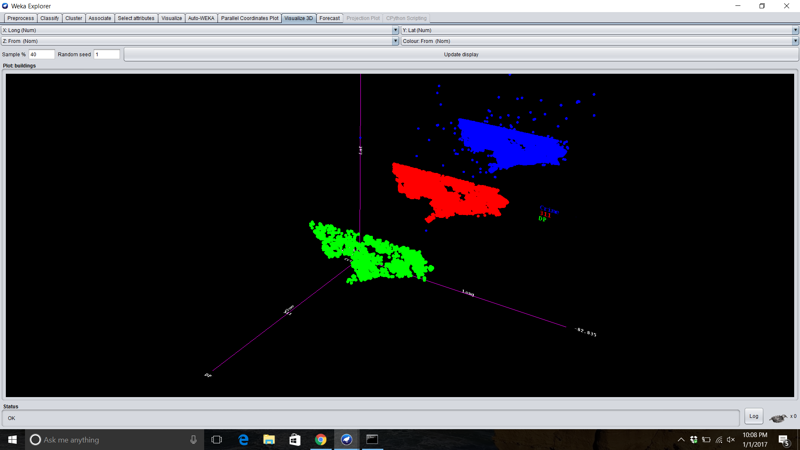

# Detroit Blight prediction

This is a coursera course assignement where I had to predict Blight issue based on house location. The key challenge is to predict house model based only on single lat-lon. I used fixed 2.5 m square as a prediction of house. 

# Details

Task of this module is to present a visualization of Detroit city phone calls from the data provided in csv file. As the data is real world, there are many wrong data entries. I wrote a script to normalize the records even when they are in separate lines. 

Once the file is normalized, I used Weka to visualize the output. 

The visulization shows the distribution of different types of calls in USA. 
